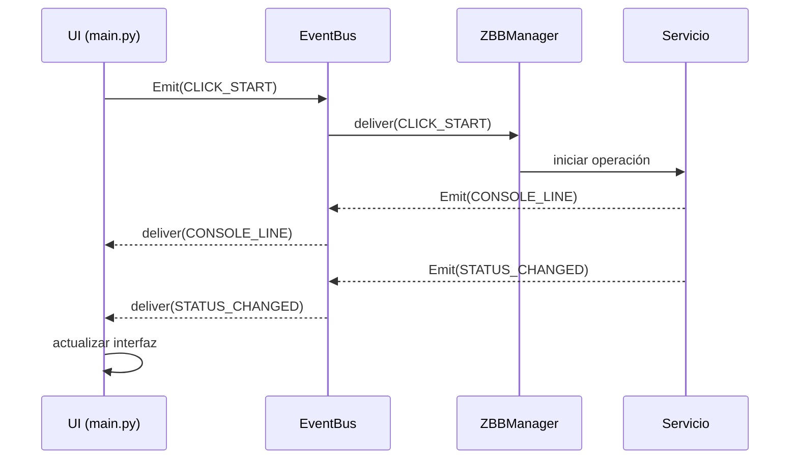

# ZeroBlockBridge — Guía de Desarrollo

## Visión General

ZeroBlockBridge (ZBB) es una aplicación Python para administrar servidores Minecraft. Prioriza simplicidad, automatización y estabilidad.

## Principios Arquitectónicos

### 1. Auto-Curación (Auto-Healing First)
- Todo proceso del servidor debe ser monitoreado por el `Watchdog Service`.
- Manejar tipos específicos de crash: `jvm_config_error`, `out_of_memory`, `oom_kill`, `boot_crash`, `runtime_crash`.
- Implementar backoff exponencial para reinicios.

### 2. Servicios sobre Monolitos (Services over Monoliths)
- Desacoplar la lógica de `main.py`.
- Mover la gestión del ciclo de vida del servidor, obtención de versiones y utilidades a `app/services/`.
- Usar el sistema `ServerEvents` para comunicar lógica y UI.
- **EventBus**: Prohibir explícitamente el uso de `.on()` en favor de `.subscribe()`.

### 3. Seguridad de Comandos (Command Security)
- Todos los comandos de consola DEBEN pasar por `CommandSanitizer`.
- Usar un filtro basado en caracteres (`|`, `;`, `&`, etc.) en lugar de una lista negra de comandos.

### 4. Gestión de Versiones de Java
- Siempre emparejar el runtime de Java con los requisitos de la versión de Minecraft:
  - MC ≥ 1.20.5: Java 21
  - MC 1.18 - 1.20.4: Java 17
  - MC 1.17 - 1.17.1: Java 16
  - MC < 1.17: Java 8
- Validar la versión de Java antes de iniciar el servidor.
- **Rango de Estabilidad**:
  - Permitir ejecución si Requerido <= Detectado <= 21.
  - Lanzar advertencia naranja si Detectado > Requerido.
  - Bloqueo rojo solo si Detectado > 21 o Detectado < Requerido.

### 5. Integración con Playit.gg
- Estandarizar el uso del agente de Playit.gg en la versión v0.17.1.
- **Regla de Oro**: El argumento para el secreto es `--secret_path` (con guion bajo). Queda estrictamente prohibido el uso de `--secret-path`.
- Los ejemplos de comandos deben incluir siempre `--stdout` y usar rutas entrecomilladas para Windows. Ejemplo: `playit --secret_path "C:\ruta\al\secreto.txt" --stdout`.

### 6. Protocolo de Inicialización de Clases (Safe Init)
- **Regla**: Todos los atributos de datos (como `self.cache`, `self.settings`) DEBEN inicializarse en la primera línea del `__init__`, antes de disparar cualquier hilo de fondo (`_warm`, `_monitor`) o suscripción al EventBus. Esto evita errores de `AttributeError`.

### 7. Filosofía Lean: Mecánica Necesaria vs. Grasa Técnica
- Antes de implementar una nueva función (ej. Port Guard, Disk Monitor, estadísticas en tiempo real), evaluar si el costo en CPU/IO/Complejidad justifica el beneficio real para el usuario.
- **Principio**: Si un error puede ser gestionado por el usuario (Capa 8 — operador humano) a través de los logs existentes, la función automática se descarta.
- **Pregunta de Filtro**: "¿Resuelve esto un problema que el usuario experimentaría al menos una vez por sesión?" Si la respuesta es "no", no se implementa.
- Esto previene el "Feature Creep" y mantiene la aplicación ligera y enfocada.

## Flujo de Comunicación UI-Core (EventBus)

Cada acción del usuario sigue este ciclo de vida a través del EventBus:

**Regla**: La UI nunca llama a servicios directamente. Todo pasa por `EventBus.emit()` → `ZBBManager` orquesta → el resultado vuelve vía `EventBus.subscribe()`.

## Guía UI (CustomTkinter)
- Usar los tokens de tema oscuro definidos en `app/core/app_config.py`.
- Mantener el patrón Wizard de 3 pasos para creación de servidores (Identidad → Motor y Recursos → Reglas y Mundo).
- Toda operación GUI debe ser no bloqueante (usar `threading` para tareas I/O).

## Convenciones
- **Idioma**: Documentación y comentarios en inglés.
- **Logging**: NO usar `print()`. Usar `logging.getLogger(__name__)`.
- **Estilo de Código**: Sin emojis en código lógico ni comentarios. Emojis permitidos solo en UI para interacción con el usuario final (botones, notificaciones).
- **Backups**: Usar formato ZIP con nomenclatura `YYYY-MM-DD_HH-MM-SS.zip`.

## Instalación Automática de JDK (JdkManager)
- `JdkManager` en `app/services/java_installer.py` descarga JDKs portables desde la API de Adoptium/Temurin.
- La caché portable se almacena en `.zbb_cache/jdks/{version}/` — nunca modifica PATH del sistema.
- **Atomic-First**: Verificación SHA256 del binario descargado antes de extraer.
- **Estructura de carpetas Adoptium**: Maneja el prefijo intermedio (`jdk-21.0.1+12/`) dentro del zip automáticamente.
- **Multiplataforma**: Soporta Windows, Linux, macOS; detecta arquitecturas x64 y ARM64.
- **Permisos**: Aplica `chmod +x` al binario en sistemas Unix post-extracción.
- **Resiliencia de Red**: Excepciones específicas `JdkDownloadError` / `JdkIntegrityError` con reintento (2 intentos).
- **Cadena de Fallback**: Java del Sistema → Caché JDK → Descarga → Error.

## Archivos Clave
| Archivo | Propósito |
|---|---|
| `app/launcher.py` | Punto de entrada principal |
| `app/ui/main.py` | Coordinación de la UI |
| `app/core/core.py` | Orquestador central (ZBBManager) |
| `app/core/logic.py` | Lógica de negocio principal (ServerRunner, Scheduler) |
| `app/core/constants.py` | Constantes globales y rutas |
| `app/core/version_manager.py` | Caché y descarga de versiones de Minecraft |
| `app/core/playit_manager.py` | Ciclo de vida del agente Playit.gg |
| `app/core/statemanager.py` | Gestión de estado global con debounce |
| `app/core/server_events.py` | Sistema EventBus (subscribe/emit) |
| `app/core/orchestrators.py` | 4 sub-orquestadores (Server, Backup, Tunnel, Scheduler) |
| `app/core/protocols.py` | Protocol classes para structural typing |
| `app/services/watchdog.py` | Detección de crashes y auto-reinicio |
| `app/services/heartbeat.py` | Monitor de latido (detección de zombies) |
| `app/services/lag_monitor.py` | Monitor de lag del servidor |
| `app/services/backup_manager.py` | Creación y restauración de backups ZIP |
| `app/services/server_properties.py` | Carga/guardado de server.properties |
| `app/services/sanitizer.py` | Seguridad de comandos |
| `app/services/bytecode_analyzer.py` | Análisis de versión Java desde el JAR |
| `app/services/java_installer.py` | Descarga automática de JDK |
| `app/services/playit_api.py` | Cliente API REST de Playit.gg |
| `app/services/sha1_validator.py` | Verificación SHA1 de descargas |
| `app/services/scaffolder.py` | Scaffolding pre-arranque del servidor |
| `app/services/aikars_flags.py` | Calculadora de flags Aikar's JVM |
| `app/services/modrinth.py` | Cliente API de Modrinth |
| `app/services/console_buffer.py` | Buffer circular de consola |
| `app/services/settings_manager.py` | Configuración global de la app |
| `app/ui/toast.py` | Sistema de notificaciones toast (UI) |
| `app/ui/players_dashboard.py` | Panel de gestión de jugadores y whitelist |
| `app/core/app_config.py` | Configuración de la aplicación (temas, tokens) |
